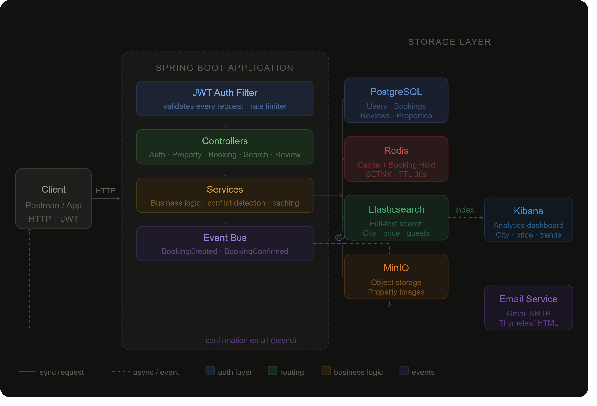

<div align="center">

# 🏠 StayFinder

**A property rental backend**


<p align="center"> <a href="YOUR_YOUTUBE_VIDEO_LINK">  </a> </p>

</div>

---

## What Is StayFinder?

StayFinder is a **REST API backend** for a property rental platform. It covers the full lifecycle — property listing, availability search, concurrent booking management, image storage, and email notifications.

The focus is on solving a specific set of backend problems correctly:

- How do you prevent two guests from booking the same dates simultaneously?
- How do you search across thousands of properties without hitting the database on every request?
- How do you keep property data consistent across a relational database, a cache, and a search index at the same time?

---

## Core Features
 
| Feature | Description |
|---------|-------------|
| Auth & Roles | JWT-based login. Three roles: `HOST`, `GUEST`, `ADMIN` |
| Property Management | Hosts can create, update, delete listings and upload photos |
| Booking Engine | Date conflict detection, booking states: `PENDING → CONFIRMED → CANCELLED` |
| Double Booking Prevention | 30-second hold on dates while a guest completes booking |
| Property Search | Search by city, price, guest count, or keyword |
| Caching | Property responses cached in Redis; cache cleared on update |
| Reviews | Guests rate stays (1–5); property average updates automatically |
| Email Notifications | Automated emails on booking creation and confirmation |
| Analytics | Kibana dashboard showing property and booking data |
| Rate Limiting | 100 requests/minute per IP |
| API Docs | Swagger UI auto-generated at `/swagger-ui/index.html` |
 
---

## Architecture


### System Overview <p align="center">  </p>


## Class Diagram

<p align="center">  </p>
## Tech Stack

### Backend

| Technology | Role |
|------------|------|
| Java 21 | Language |
| Spring Boot 3.5 | Application framework |
| Spring Security + JJWT 0.12 | Stateless JWT authentication, role-based access control |
| Spring Data JPA + Hibernate 6 | ORM and relational database access |
| Spring Mail + Thymeleaf | Async HTML email notifications |
| Spring ApplicationEvent | Decoupled async event bus for booking lifecycle |
| Bucket4j 8.7 | Token bucket rate limiting — 100 req/min per IP |
| SpringDoc OpenAPI 2.5 | Auto-generated Swagger UI |
| Lombok | Boilerplate reduction (`@Builder`, `@Getter`, etc.) |
| Maven | Build and dependency management |

### Database & Storage

| Technology | Role |
|------------|------|
| PostgreSQL 16 | Primary relational store — users, bookings, reviews |
| Redis 7 | Response cache (cache-aside) + distributed booking hold (`SETNX`) |
| Elasticsearch 8.13 | Full-text and filtered property search index |
| MinIO | S3-compatible self-hosted object storage for property images |

### Analytics & Observability

| Technology | Role |
|------------|------|
| Kibana 8.13 | Analytics dashboard over Elasticsearch index |
| Spring Actuator | Health check endpoint (`/actuator/health`) |

### Infrastructure

| Technology | Role |
|------------|------|
| Docker + Docker Compose | Local orchestration — single command starts all services |

> **Frontend:** This is a backend-only project. The API is consumed via Swagger UI (`/swagger-ui/index.html`) or any REST client. A frontend can be built on top of the existing endpoints.

---

## Setup

### Prerequisites

- Java 21
- Maven 3.8+
- Docker Desktop (running)

### Run

```bash
git clone https://github.com/falak-khan/stayfinder.git
cd stayfinder

# Start all infrastructure
docker-compose up -d

# Verify containers
docker-compose ps   # expect: postgres, redis, elasticsearch, kibana, minio — all Up
```

**MinIO bucket setup** (one-time):
1. Open `http://localhost:9001` → login `minioadmin / minioadmin`
2. Create bucket named `stayfinder`, set access policy to **Public**

**application.properties** — fill in before running:
```properties
spring.datasource.url=jdbc:postgresql://localhost:5432/stayfinder
spring.datasource.username=postgres
spring.datasource.password=postgres

minio.url=http://localhost:9000
minio.access-key=minioadmin
minio.secret-key=minioadmin
minio.bucket=stayfinder

spring.data.redis.host=localhost
spring.data.redis.port=6379

spring.elasticsearch.uris=http://localhost:9200

jwt.secret=your-secret-key-minimum-32-characters
jwt.expiration=86400000

spring.mail.host=smtp.gmail.com
spring.mail.port=587
spring.mail.username=YOUR_GMAIL
spring.mail.password=YOUR_APP_PASSWORD    # Gmail → Security → App Passwords
```

```bash
./mvnw spring-boot:run
```

Swagger UI: `http://localhost:8080/swagger-ui/index.html`
Kibana: `http://localhost:5601`

---


## Authors

**Falak Khan** · [GitHub](https://github.com/falak-khan) · [LinkedIn](#)

**Fiza Khan** · [GitHub](https://github.com/fiza-khan) · [LinkedIn](#)

---

<div align="center">
<sub>Built with Spring Boot · PostgreSQL · Redis · Elasticsearch · MinIO</sub>
</div>
